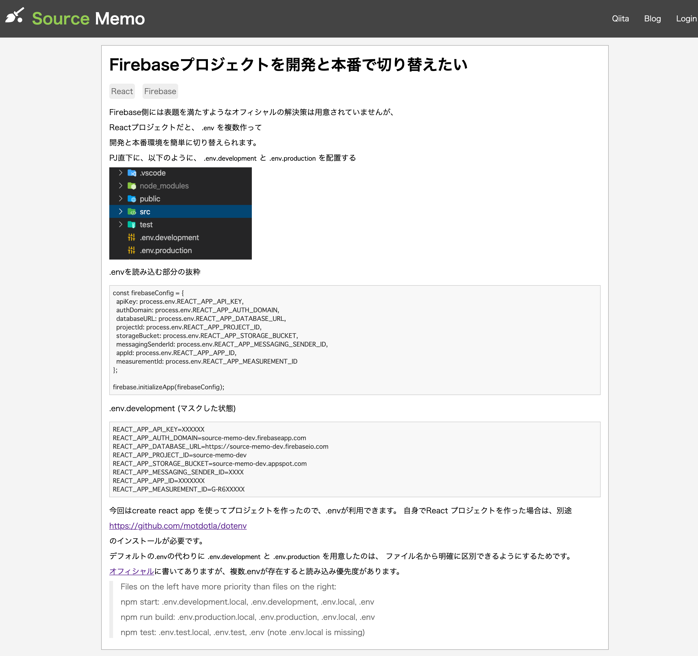
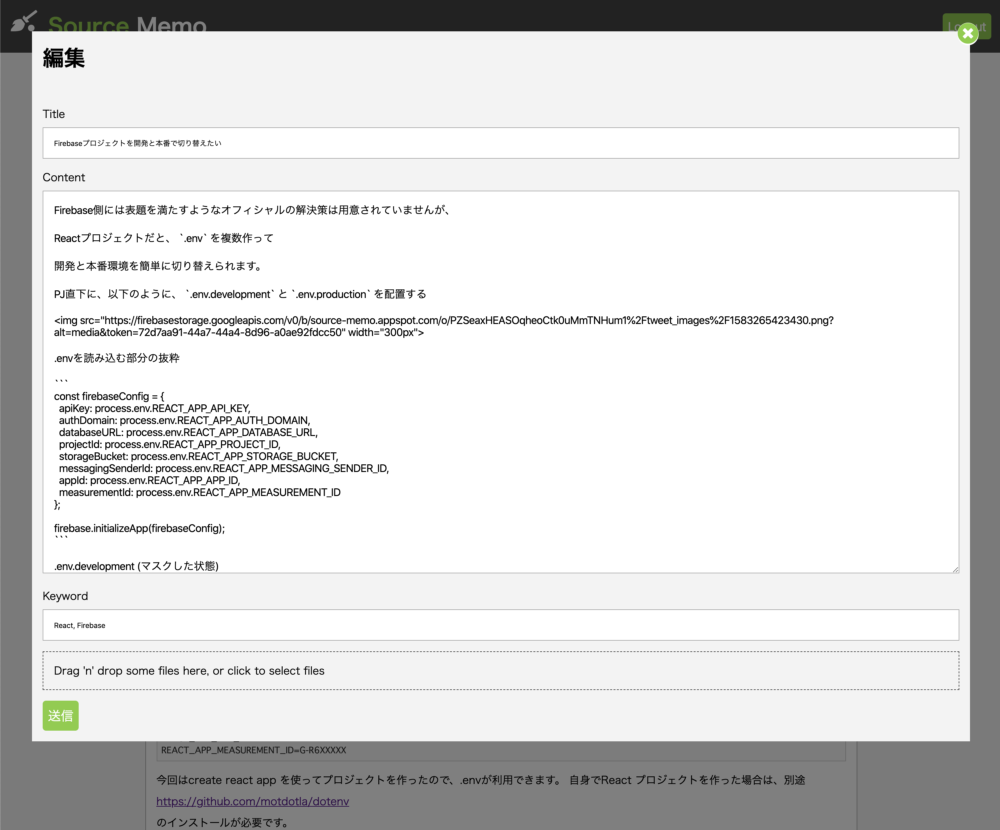

# Source Memo

Source Memo is a markdown memo service.

Created to write notes that is long enough to write on Twitter, but not as organized as writing on a blog.

[source memo example](https://source-memo.firebaseapp.com/)

# Images

Site Top


Editor


# Usage

- TypeScript
- React (Hooks)
- Redux
- Cloud Firestore (Firebase)
- Cloud Storage (Firebase)
- Authentication (Firebase)
- Hosting (Firebase)

# Setup

## Setup firebase Services

- Cloud Firestore
- Cloud Storage
- Authentication
- Hosting

## Make .env.development & .env.production files

Put `.env.development` & `.env.production` into root path.

ex) .env.development

```
REACT_APP_API_KEY=XXXXXX
REACT_APP_AUTH_DOMAIN=source-memo-dev.firebaseapp.com
REACT_APP_DATABASE_URL=https://source-memo-dev.firebaseio.com
REACT_APP_PROJECT_ID=source-memo-dev
REACT_APP_STORAGE_BUCKET=source-memo-dev.appspot.com
REACT_APP_MESSAGING_SENDER_ID=XXXX
REACT_APP_APP_ID=XXXXXXX
REACT_APP_MEASUREMENT_ID=G-R6XXXXX
```

Please rewrite your values.

## Uncomment

App.tsx

```
// import CreateUserForm from './components/pages/CreateUserForm';
```

App.tsx

```
<Switch>
    {/* <PublicRoute path="/createUser" component={CreateUserForm} /> */}
    <Route exact path="/" component={Timeline} />
    <PublicRoute path="/login" component={LoginForm} />
    <PrivateRoute path="/dashboard" component={DashBoard} />
    <PrivateRoute path="/logout" component={Logout} />
</Switch>
```

Navbar/index.ts

```
{/* <li>
    <StyledLink to="createUser">Create User</StyledLink>
</li> */}
```

## Install

```
npm install
```

# Commands

## Run

```
npm run start
```

## Test

```
npm run test
```

## Deploy

```
npm run deploy
```

## Deploy (Only Cloud Firestore security rule)

```
npm run deploy-db-rules
```

## Change Deploy Target

- staging

```
npm run env-staging
```

- production

```
npm run env-production
```

# Licence

Source Memo is under MIT license.
